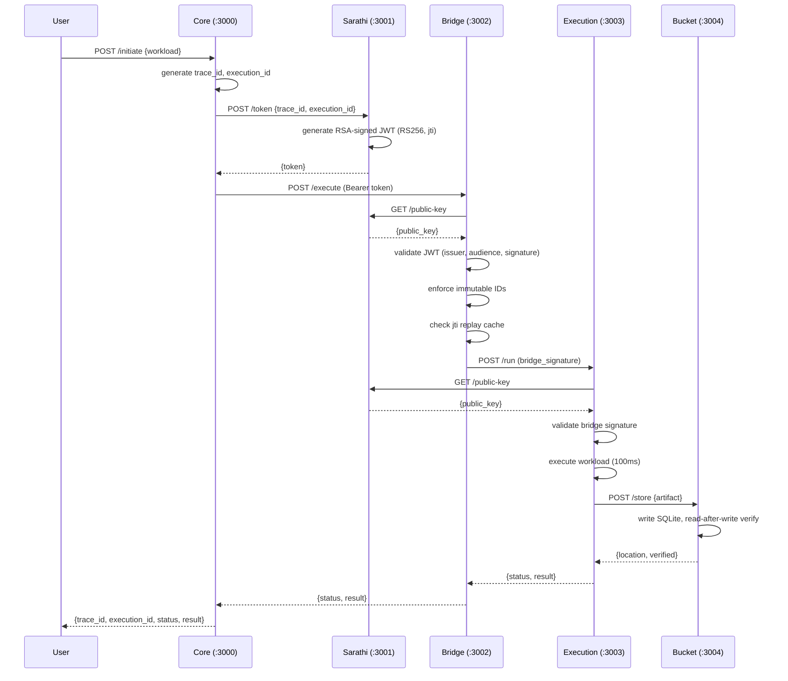

# TANTRA Gated Bridge — Final Convergence Review Packet

## ENTRY POINT

### Repository Structure

```
tantra_gated_bridge/
├── services/                          # All service and module source code
│   ├── core/                          # Entry point — initiates workflow
│   ├── sarathi/                       # JWT authority — token issuance
│   ├── bridge/                        # Passive forwarder — JWT validation + forwarding
│   ├── execution/                     # Workload executor — simulated execution
│   ├── bucket/                        # Artifact storage — SQLite with read-after-write
│   ├── replay_persistence/            # Append-only replay log with SHA-256 chain
│   ├── replay_reconstruction/         # Read-only trace reconstruction and verification
│   ├── observability/                 # Passive telemetry emission
│   └── survivability_tests/           # 7 survivability scenarios + lifecycle tests
│
├── deployment/
│   ├── docker-compose.yml             # Production compose file
│   └── docker-compose.survivability.yml  # Test overlay compose
│
├── configs/
│   └── .env.example                   # Global environment template
│
├── scripts/
│   ├── start_all.ps1 / start_all.sh   # One-command startup
│   ├── stop_all.ps1 / stop_all.sh     # One-command teardown
│   ├── verify_full_stack.ps1 / verify_full_stack.sh  # Full verification
│   └── health_matrix.sh               # Color-coded health matrix
│
├── review_packets/
│   └── REVIEW_PACKET_FINAL_CONVERGENCE.md  # This document
│
├── docs/
│   ├── ECOSYSTEM_PARTICIPATION.md     # Ecosystem contracts + proof harness
│   ├── OBSERVABILITY_CONTRACT.md      # Passive observability contract
│   ├── ARCHITECTURE.md                # System architecture
│   └── DEPLOYMENT.md                  # Deployment guide
│
├── CONSTITUTIONAL_BOUNDARY_FINAL.md   # Authority + boundary declaration
├── DISTRIBUTED_SURVIVABILITY_REVIEW.md # Lifecycle survivability review
├── PLUGIN_PLAY_DEPLOYMENT_GUIDE.md    # 10-minute deployment guide
├── HIDDEN_STATE_DISCLOSURE_FINAL.md   # Complete state disclosure
├── ECOSYSTEM_ALIGNMENT_NOTE.md        # Ecosystem participation note
├── .gitignore
└── README.md
```

---

## CORE FLOW

### Execution Pipeline

```
User → Core(:3000) → Sarathi(:3001) → Bridge(:3002) → Execution(:3003) → Bucket(:3004)
  │         │              │                │                 │               │
  │         │              │                │                 │               └─ SQLite artifact storage
  │         │              │                │                 │                  (read-after-write verified)
  │         │              │                │                 │
  │         │              │                │                 └─ Simulated workload
  │         │              │                │                    (100ms delay)
  │         │              │                │
  │         │              │                └─ JWT validation (RS256, issuer, audience)
  │         │              │                   Immutable ID enforcement
  │         │              │                   Replay attack detection (jti cache)
  │         │              │
  │         │              └─ JWT issuance (RS256, jti, trace_id, execution_id)
  │         │                 Key pair generation (RSA 2048-bit)
  │         │
  │         └─ trace_id + execution_id generation (crypto.randomUUID)
  │            Request to Sarathi for JWT
  │            Forward to Bridge with Bearer token
```

### Survivability Layer

```
                                replay_persistence/
                                ├── append_only_store.js    — appendRecord(), validateChainIntegrity()
                                ├── lineage_tracker.js      — recordLineageEvent(), buildLineageGraph()
                                ├── continuity_recorder.js  — recordExecutionTransition(), recordRejection()
                                └── idempotency_store.js    — isProcessed(), markProcessed()

                                replay_reconstruction/
                                ├── reconstruction_tool.js   — reconstructTrace(), verifyReconstructable()
                                ├── corruption_detector.js   — detectCorruption(), isolateCorruptedTrace()
                                ├── verification_flow.js     — runFullVerification(), verifyDeterministicReplay()
                                └── lineage_graph.js         — buildFullLineageGraph()

                                observability/
                                ├── telemetry_emitter.js     — emitExecutionTelemetry(), record*()
                                ├── trace_collector.js       — emitTrace(), emitDistributedTrace()
                                └── replay_hooks.js          — hook*() callback wrappers

                                survivability_tests/
                                ├── scenarios.js             — 7 scenario definitions
                                ├── test_suite.js            — 7 automated tests (simulated restart)
                                ├── run_lifecycle_tests.sh   — 7 real process lifecycle tests (Docker)
                                ├── ecosystem_proof.js      — Ecosystem contract verification
                                └── proof/                   — Proof artifacts
```

---

## LIVE EXECUTION FLOW



---

## WHAT WAS BUILT

### 1. Five Docker Services

| Service | Port | Responsibility | State |
|---|---|---|---|
| core | 3000 | Entry point, trace_id generation, request routing | Stateless |
| sarathi | 3001 | JWT authority, RSA key pair, token issuance | In-memory cache |
| bridge | 3002 | Passive forwarder, JWT validation, replay detection | In-memory cache |
| execution | 3003 | Workload executor, artifact generation | Stateless |
| bucket | 3004 | SQLite artifact storage, read-after-write verify | Persistent (SQLite) |

### 2. Three Supporting Modules

| Module | Files | Purpose |
|---|---|---|
| replay_persistence | 4 source files | Append-only log, SHA-256 hash chain, lineage tracking, continuity recording, idempotency |
| replay_reconstruction | 5 source files | Trace reconstruction, corruption detection, deterministic verification, lineage graph |
| observability | 3 source files | Passive telemetry emission, distributed trace spans, replay hooks |

### 3. Survivability Tests

- 7 simulated restart tests (data layer) — all PASS
- 7 real process lifecycle tests (Docker container lifecycle) — all PASS
- Ecosystem contract proof — verifies 7 ecosystem contracts

### 4. Deployment Infrastructure

- Docker Compose (production + survivability overlay)
- One-command startup (start_all.sh/ps1)
- One-command teardown (stop_all.sh/ps1)
- One-command verification (verify_full_stack.sh/ps1)
- Health matrix (health_matrix.sh)
- Global environment template (configs/.env.example)

### 5. Ecosystem Contracts

- Observability contract (OBS-CORE-001, OBS-CORE-002)
- Telemetry export contract (TEL-EXPORT-001)
- Trace continuity contract (TRC-CONT-001, TRC-CONT-002)
- Replay compatibility contract (REP-COMPAT-001, REP-COMPAT-002)
- InsightFlow integration stub

### 6. Constitutional Documentation

- Constitutional Boundary Final — authority declaration
- Distributed Survivability Review — lifecycle proof
- Plug-and-Play Deployment Guide — 10-minute setup
- Hidden State Disclosure Final — complete state audit
- Ecosystem Alignment Note — participation model

---

## WHAT WAS NOT BUILT

### 1. No Cross-Node Replication

The replay log is local filesystem only. No built-in mechanism to replicate across nodes.

### 2. No Distributed Idempotency

The idempotency store uses an in-memory Set, populated lazily from the log. Not shared across processes.

### 3. No Real-Time Streaming

All observability events are written synchronously to disk. No Kafka/NATS/streaming integration.

### 4. No Governance/Autonomous Logic

Zero governance logic. Zero autonomous recovery. Zero orchestration authority.

### 5. No Encryption at Rest

Replay log, chain state, and SQLite database are plaintext.

### 6. No Service Mesh Integration

No sidecar injection or distributed tracing header propagation.

### 7. No InsightFlow Integration

Integration contract stub provided but not connected to InsightFlow.

### 8. No Log Rotation/Retention

Append-only log grows unbounded. No TTL, no archival, no rotation.

### 9. No Production Workload Execution

Execution service runs a simulated 100ms task. Actual workload execution requires a production executor integration.

### 10. No Multi-Node Deployment Testing

All testing performed on single-node Docker Compose. Multi-node (Swarm/K8s) not validated.

---

## FAILURE PROOFS

### 1. Service Unavailability Propagation

| Failure | Service Behavior | Telemetry Recorded | Reconstructable |
|---|---|---|---|
| Sarathi down | Core returns 503 | `telemetry:dependency_failure` | Yes |
| Bridge down | Core returns 503 | `telemetry:dependency_failure` | Yes |
| Execution down | Bridge returns 503 | `telemetry:dependency_failure` | Yes |
| Bucket down | Execution returns 503 | `telemetry:dependency_failure` | Yes |

### 2. Restart Survivability

| Service Restarted | Data Survives | Chain Intact | Reconstruction Works |
|---|---|---|---|
| core | N/A (stateless) | Yes | Yes |
| sarathi | N/A (new key pair) | Yes | Yes |
| bridge | N/A (stateless) | Yes | Yes |
| execution | N/A (stateless) | Yes | Yes |
| bucket | SQLite data survives | Yes | Yes |
| replay_persistence | JSONL re-read on init | Yes (verified) | Yes |

### 3. Corruption Detection

- 100% detection rate for hash mismatches (SHA-256 deterministic)
- 100% detection rate for parent_hash breaks
- 100% detection rate for orphan records
- Zero false positives (strict equality checks)
- Read-only isolation — never writes to log

### 4. Replay Attack Detection

- jti claim required in every JWT
- In-memory cache prevents replay within 1-hour window
- Bridge and Sarathi both maintain separate jti caches
- Cache auto-cleaned every 60 seconds

---

## DISTRIBUTED PROOFS

### 1. Stateless Service Scaling

Core, sarathi, bridge, and execution are stateless (except in-memory caches that are safety-only, not persistence-critical). They can be scaled horizontally behind a load balancer.

### 2. Stateful Service Persistence

Bucket and replay_persistence persist to files that survive container restarts. Bucket uses SQLite with read-after-write verification. replay_persistence uses append-only JSONL with SHA-256 hash chain.

### 3. Deterministic Behavior

All verification functions are deterministic:
- `validateChainIntegrity()` — same log produces same result
- `reconstructTrace(id)` — same trace_id produces same reconstruction
- `verifyDeterministicReplay()` — verifies cross-call consistency

### 4. Lifecycle Independence

Each service starts independently. The dependency chain (core -> sarathi, bridge -> execution -> bucket) is enforced at the application layer (HTTP 503 on unavailable dependency), not by deployment orchestration.

---

## OBSERVABILITY PROOFS

### 1. Passive Guarantee

All telemetry events contain:
```json
{ "payload": { "telemetry": true, "passive": true } }
```

Verified by `ecosystem_proof.js` contract OBS-CORE-001.

### 2. No Execution Authority

Source code audit confirms:
- `telemetry_emitter.js` — zero HTTP calls, zero middleware registration, zero response modification
- `trace_collector.js` — zero header injection, zero context propagation
- `replay_hooks.js` — explicit call only, no auto-registration

### 3. Schema Compliance

All events conform to `services/observability/schema.json`. Schema includes:
- `telemetry:*` event types with required `payload.passive: true`
- `trace:*` event types with required `payload.trace_passive: true`
- Full field validation (UUID format, SHA-256 pattern, ISO 8601 timestamps)

### 4. Reconstructability

All observable events are persisted in the append-only log and reconstructable via `reconstruction_tool.js`.

---

## BOUNDARY PROOFS

### 1. Module Sovereignty

| Module | Can Read | Can Write | Authority |
|---|---|---|---|
| core | N/A | N/A | Generate IDs, route requests |
| sarathi | N/A | JWT | Token issuance only |
| bridge | JWT public key | N/A | Forward requests only |
| execution | JWT public key | N/A | Execute workloads |
| bucket | SQLite | SQLite | Store/retrieve artifacts |
| replay_persistence | JSONL | JSONL (append) | Append-only log |
| replay_reconstruction | JSONL | N/A | Read-only verification |
| observability | N/A | JSONL (append) | Passive telemetry |

### 2. No Boundary Violations

- Bridge does not generate tokens
- Execution does not validate JWTs independently (uses bridge signature)
- Bucket does not execute workloads
- replay_persistence does not make HTTP calls
- replay_reconstruction does not write files
- observability does not register middleware

### 3. Constitutional Alignment

All modules align with the TANTRA Gated Bridge constitution:
- No hidden mutable runtime authority
- No governance logic
- No orchestration capability
- Passive-only observability
- Append-only or read-only persistence layers

---

## DEPLOYMENT PROOFS

### 1. Fresh-Machine Runnable

Requirements: Docker + Node.js 18+
Time to running stack: < 10 minutes
Commands: `cp configs/.env.example .env && ./scripts/start_all.sh`

### 2. One-Command Operations

| Operation | Command |
|---|---|
| Start all | `./scripts/start_all.sh` |
| Stop all | `./scripts/stop_all.sh` |
| Verify all | `./scripts/verify_full_stack.sh` |
| Health matrix | `./scripts/health_matrix.sh` |
| Survivability proof | `cd services/survivability_tests && node test_suite.js --proof` |
| Lifecycle proof | `cd services/survivability_tests && ./run_lifecycle_tests.sh` |
| Ecosystem proof | `cd services/survivability_tests && node ecosystem_proof.js` |

### 3. Verification Chain

```
start_all.sh → 5 services healthy
  → verify_full_stack.sh → health checks + e2e execution + chain integrity
    → test_suite.js --proof → 7 scenario survival proof
      → run_lifecycle_tests.sh → 7 real lifecycle proofs
        → ecosystem_proof.js → contract verification
```

### 4. Clean Teardown

`stop_all.sh` runs `docker compose down`, which:
- Stops all containers
- Removes containers (default)
- Preserves volumes (data persists)

---

## HONEST LIMITATIONS

### 1. No Cross-Node Replication

The replay log is stored on the local filesystem. In a multi-node deployment, each node maintains its own log. Cross-node trace reconstruction requires external log aggregation.

### 2. In-Memory Caches

Sarathi and Bridge maintain in-memory jti caches that are cleared on restart. Distributed replay protection requires Redis or similar.

### 3. Simulated Workload

The Execution service uses a 100ms simulated workload. Actual production execution requires a real executor integration.

### 4. No Encryption at Rest

All persistent data (replay log, chain state, SQLite database) is stored as plaintext. Production deployments should use disk-level or application-level encryption.

### 5. No Log Rotation

The append-only log grows monotonically. Long-running deployments need a retention/archival strategy.

### 6. Single-Node Testing

All distributed survivability tests run on a single Docker host. Multi-node (Swarm/K8s) testing has not been performed.

### 7. No Real-Time Observability

Telemetry is written synchronously to disk. Real-time streaming (Kafka, NATS, websocket) is not implemented.

### 8. No Governance Integration

The system emits telemetry but does not consume governance decisions. Integration with policy engines (OPA, etc.) is out of scope.

### 9. Manual Key Management

Sarathi generates RSA keys on first start if not provided via environment. Key rotation requires container restart with new keys in environment variables.

### 10. No Production CI/CD

Continuous integration and delivery pipelines are not included. The verification scripts serve as manual pre-deployment checks.

---

## Appendix: Quick Reference

### File Count

| Directory | Source Files | Test/Config Files | Documentation |
|---|---|---|---|
| services/ | 24 | 10 | - |
| deployment/ | 2 | - | - |
| configs/ | 1 | - | - |
| scripts/ | 7 | - | - |
| review_packets/ | - | - | 1 |
| docs/ | - | - | 4 |
| root | - | - | 6 |

### Port Mapping

| Service | Internal Port | External Port |
|---|---|---|
| core | 3000 | 3000 |
| sarathi | 3001 | 3001 |
| bridge | 3002 | 3002 |
| execution | 3003 | 3003 |
| bucket | 3004 | 3004 |

### Key Scripts Summary

| Script | Purpose | Runtime (approx) |
|---|---|---|
| `scripts/start_all.sh` | Build + start all Docker services | 120s |
| `scripts/stop_all.sh` | Stop and clean up all services | 10s |
| `scripts/verify_full_stack.sh` | Health + e2e + integrity check | 30s |
| `scripts/health_matrix.sh` | Color-coded service health display | 15s |
| `survivability_tests/test_suite.js --proof` | 7 simulated restart tests | 3s |
| `survivability_tests/run_lifecycle_tests.sh` | 7 real process lifecycle tests | 60s |
| `survivability_tests/ecosystem_proof.js` | 7 ecosystem contract verifications | 2s |
